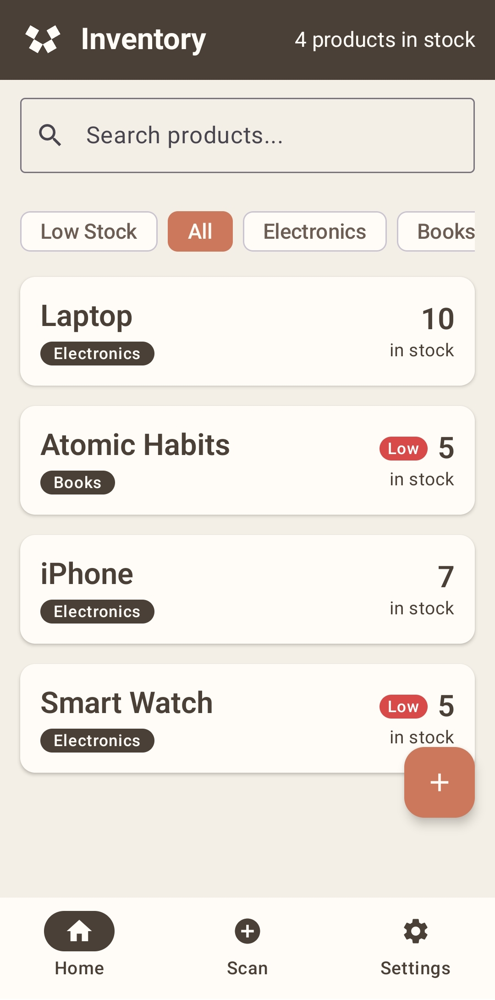
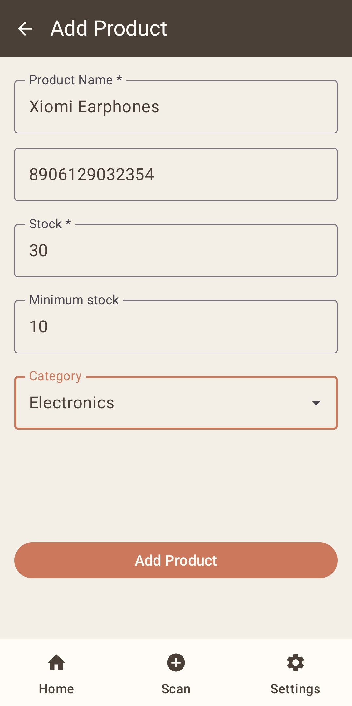
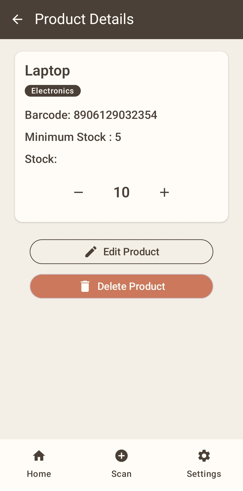
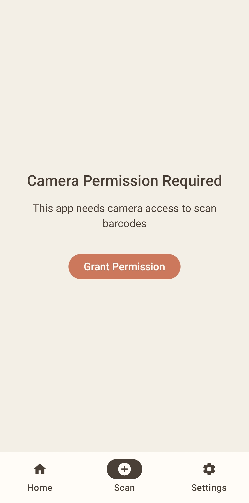
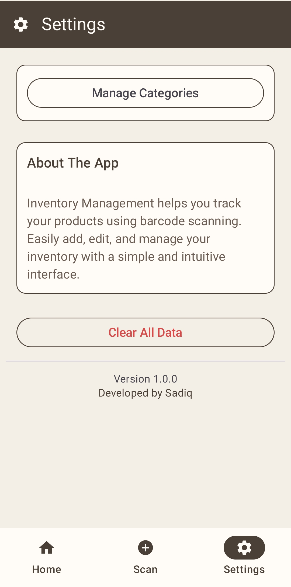

# 📦 Inventory Management App


**A modern, feature-rich inventory management solution built with the latest Android technologies.**

---

## 📖 About

A production-ready Android application for managing inventory, tracking stock levels, and organizing products by categories. Built following modern Android development best practices with **MVVM architecture**, **Jetpack Compose**, and **Clean Architecture** principles.

Perfect for small businesses, warehouses, or personal inventory tracking needs.

---

## ✨ Features

### 🏠 Product Management
- ✅ **Add, Edit, Delete** products with ease
- ✅ **Real-time search** across product names
- ✅ **Category filtering** for organized inventory
- ✅ **Low stock alerts** - automatically flag products below minimum threshold
- ✅ **Stock tracking** with quantity management

### 📷 Barcode Scanner
- 📱 Scan product barcodes for quick lookup
- 🔍 Auto-populate product information
- ⚡ Fast product identification

### 🎨 Modern UI/UX
- 🌈 Material Design 3 components
- 📱 Responsive layouts
- 🎯 Intuitive navigation with bottom bar
- ⚡ Smooth animations and transitions

### ⚙️ Settings & Configuration
- 🗂️ **Category Management** - Create, edit, delete categories
- 🎨 Theme customization (coming soon)
- 💾 Data backup & restore (planned)

---

## 📸 Screenshots

### Home Screen


### Add Product


### Product Details


### Barcode Scanner


### Settings


---

## 🏗️ Architecture

This project follows **Clean Architecture** and **MVVM** pattern:

```
┌─────────────────────────────────────────┐
│          Presentation Layer             │
│   (Compose UI + ViewModels + State)    │
├─────────────────────────────────────────┤
│           Domain Layer                  │
│     (Use Cases + Business Logic)        │
├─────────────────────────────────────────┤
│            Data Layer                   │
│  (Room Database + Repository Pattern)   │
├─────────────────────────────────────────┤
│        Dependency Injection             │
│         (Hilt Modules)                  │
└─────────────────────────────────────────┘
```

### Why MVVM?
- ✅ **Separation of Concerns** - UI, business logic, and data layers are decoupled
- ✅ **Testability** - Each layer can be tested independently
- ✅ **Maintainability** - Easy to add features or fix bugs
- ✅ **Lifecycle Awareness** - ViewModels survive configuration changes

---

## 🛠️ Tech Stack

### Core
- **Language:** [Kotlin](https://kotlinlang.org/) - 100% Kotlin codebase
- **UI Framework:** [Jetpack Compose](https://developer.android.com/jetpack/compose) - Modern declarative UI
- **Architecture:** MVVM + Repository Pattern

### Jetpack Components
- 🗄️ **Room Database** - Local data persistence
- 🧭 **Navigation Compose** - Type-safe navigation
- 🔄 **StateFlow** - Reactive state management
- ⚡ **Coroutines** - Asynchronous programming
- 🎯 **Hilt** - Dependency injection

### Material Design
- 🎨 **Material 3** - Latest Material Design components
- 🌈 **Dynamic theming** - Adaptive color schemes

---

## 📂 Project Structure

```
com.example.inventorymanagement/
│
├── data/
│   ├── local/
│   │   ├── dao/              # Database access objects
│   │   ├── entity/           # Room entities
│   │   └── AppDatabase.kt    # Database configuration
│   └── repository/           # Data repositories
│
├── di/                       # Hilt dependency injection modules
│
├── navigation/               # Navigation graph & routes
│   ├── NavGraph.kt
│   └── Screen.kt
│
├── uii/                      # UI layer
│   ├── home/                 # Home screen & ViewModel
│   ├── product/              # Add/Edit product screens
│   ├── scan/                 # Barcode scanner
│   └── settings/             # Settings & categories
│
├── MainActivity.kt           # Single activity host
└── MyApp.kt                  # Application class with Hilt
```

---

## 🚀 Getting Started

### Prerequisites
- Android Studio Hedgehog (2023.1.1) or later
- JDK 17 or higher
- Minimum SDK: 24 (Android 7.0)
- Target SDK: 34 (Android 14)

### Installation

**1. Clone the repository**
```bash
git clone https://github.com/sadiq-mehdi/Inventory-App.git
cd Inventory-App
```

**2. Open in Android Studio**
- File → Open → Select project folder
- Wait for Gradle sync to complete

**3. Run the app**
- Connect your device or start an emulator
- Click Run (▶️) or press `Shift + F10`

### Build APK
```bash
./gradlew assembleDebug
```
APK will be generated at: `app/build/outputs/apk/debug/`

---

## 🎯 Key Highlights

### What Makes This App Special?

| Feature | Implementation |
|---------|---------------|
| **Offline-First** | All data stored locally with Room - works without internet |
| **Type-Safe Navigation** | Uses sealed classes for compile-time safety |
| **Reactive UI** | StateFlow ensures UI updates automatically when data changes |
| **Dependency Injection** | Hilt provides clean, testable architecture |
| **Modern UI** | 100% Jetpack Compose - no XML layouts |
| **Scalable** | Clean Architecture allows easy feature additions |

---

## 📈 Roadmap & Future Enhancements

- [ ] **Cloud Sync** - Firebase integration for multi-device support
- [ ] **Export/Import** - CSV/Excel data export
- [ ] **Dark Mode** - System-wide dark theme support
- [ ] **Analytics Dashboard** - Stock trends and insights
- [ ] **Multi-language** - Localization support
- [ ] **Unit Tests** - Comprehensive test coverage
- [ ] **Animations** - Enhanced UI transitions
- [ ] **Widgets** - Home screen quick actions

---

## 🐛 Known Issues

- ⚠️ Database uses `fallbackToDestructiveMigration()` - data loss on schema changes
  - **Fix planned:** Implement proper Room migrations

---

## 🤝 Contributing

Contributions are welcome! Please feel free to submit a Pull Request.

1. Fork the project
2. Create your feature branch (`git checkout -b feature/AmazingFeature`)
3. Commit your changes (`git commit -m 'Add some AmazingFeature'`)
4. Push to the branch (`git push origin feature/AmazingFeature`)
5. Open a Pull Request

---

## 👨‍💻 Author

**Sadiq Mehdi Ali Khan**

BCA Student | Android Developer | Kotlin Enthusiast

[](https://github.com/sadiq-mehdi)
[](https://linkedin.com/in/sadiq-mehdi)

---

## 📄 License

This project is licensed under the MIT License - see the [LICENSE](LICENSE) file for details.

---

## ⭐ Show Your Support

If you found this project helpful or interesting, please consider giving it a ⭐ on GitHub!

**Made with ❤️ using Kotlin & Jetpack Compose**
